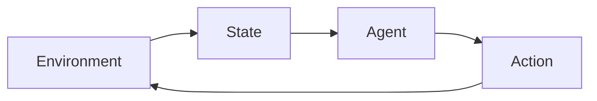

## Introduction

> The basic flow of Reinforcement Learning

Program compilation is the process of turning source code into 1 s and 0s.
Optimizing this process to produce faster or smaller code is one of the most complex tasks performed on computers today.
There are two main issues to consider when performing compiler optimization: the selection of flags and the ordering of said flags.
Selection on it's own is O(2 n ), and ordering is O(n!).
Attempting to optimize both selection and ordering is a daunting task!
If we can create a compiler capable of automatically tuning programs for speed or size, we can make every device on the planet run better, potentially saving billions of hours of computational time.

## Methods and Results

AlphaZero by DeepMind is one of the most advanced Reinforcement Learning Algorithms in the world, having mastered multiple different board games _tabula rasa_ (starting with zero previous knowledge).
To master these games, it used a single neural network with two outputs, a policy and value approximation.
The policy output represents the probability of each action helping increase the final reward, whereas the value output indicates the approximate reward attainable from the current state of the game.
AlphaZero refined both it's policy and it's value approximation via Monte Carlo Tree Searches (pictured above).

For this project the AlphaZero framework was adapted to the problem of program compilation optimization with regards to speed, rather than size.
In order to train this network, a Monte Carlo Tree Search was used to refine the policy, while the results from each step were used to refine the value approximation, differing slightly from the original.

Unfortunately, the model suffered learned to cheat quite severely, a problem all to common in the field of Reinforcement Learning, which saw it converge to always trying a single flag, as many times as allowed.

Increasing the number of simulations may have helped combat this effect, as it would have induced greater exploration.

All 101 inputs to the model were generated by the Microarchitecture-independent Workload Characterization plugin, which was used to dynamically profile the given application with any set of flags.
Overall, seven flags were considered at each step, all of which were binary (on or off).
Although there are flags which do have levels, they were not considered for this project.
The agent was allowed to repeat flags.

## Conclusions

Although this method did yield some performance improvements compared to no optimization flags, one can only conclude that the model fell short of expectations.

Furthermore, the Monte Carlo Tree Search is simply too computationally inefficient to be considered viable for further exploration on this topic, as requiring a compilation / execution step during every simulation means one rollout can take minutes to complete, rather than the seconds it takes for a traditional board game.

Overall the results are positive enough to indicate reinforcement learning may be able to fully solve this problem in the near future, however AlphaZero's framework should no longer be considered a viable candidate for the solution.

## Future Works

Compiler optimization appears to be a problem more suited to genetic algorithms than traditional reinforcement learning approaches.
The communication of a single "fitness" value would be much more computationally efficient than performing multiple rollouts in a single step.
Additionally, the model produced by the genetic evolution would also be much faster at evaluation, as it wouldn't require any Monte Carlo Tree Search to select a flag to use.

## Get the Code

This project can be found under [COREL](https://github.com/thoward27/COREL), a repository dedicated to solving compiler optimization using reinforcement learning

## Sources

Ashouri, Amir Hossein, et al. “Cobayn.” ACM Transactions on Architecture and Code Optimization, vol. 13, no. 2, 2016, pp. 1–25., doi:10.1145/2928270.

Bhatt, Shweta. “KDnuggets.” KDnuggets Analytics Big Data Data Mining and Data Science, 2018, www.kdnuggets.com/2018/03/5-things-reinforcement-learning.html.

Hoste, Kenneth, and Lieven Eeckout. “MICROARCHITECTURE-INDEPENDENT WORKLOAD CHARACTERIZATION.” Microarchitecture-Independent Workload Characterization - IEEE Journals &amp; Magazine, 2007, ieeexplore.ieee.org/document/4292057/.

“Monte Carlo Tree Search.” Wikipedia, Wikimedia Foundation, 6 May 2019, en.wikipedia.org/wiki/Monte_Carlo_tree_search.

Silver, David, et al. “A General Reinforcement Learning Algorithm That Masters Chess, Shogi, and Go through Self-Play.” Science, vol. 362, no. 6419, 2018, pp. 1140–1144., doi:10.1126/science.aar6404.
